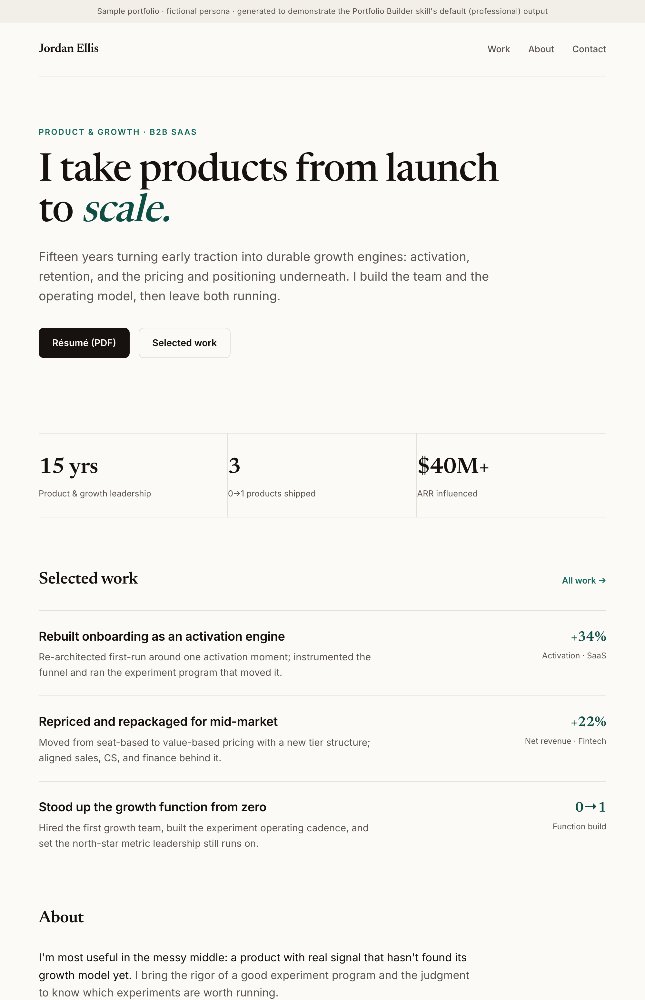

# portfolio-builder

A Claude Code skill that builds a truthful, well-designed personal portfolio site from a real person's real history — for job seekers, freelancers, advisors, founders, and operators.



*A sample the skill produced. The generation is the easy part; the honesty gate and the design-critique loop are what make it worth using.*

## What it does

- **Refuses to fabricate.** Every metric, title, date, employer, and story is tagged by source and reconciled across documents. A claim the person can't defend is cut or reframed — it never ships. A pre-launch claims ledger flags anything unconfirmed and blocks the publish.
- **Runs a real design-critique loop.** Starts from a locked design system, renders, critiques its own output against a taste checklist, gets the person's reaction, and iterates. Mobile-first, verified at 375px. Built to avoid templated, AI-slop output.
- **Positions before it designs.** A six-phase process — intake, positioning, content, design, infra, honesty gate — that reads target job descriptions and reconciles sources before writing a single line of HTML.
- **Ships the whole package.** SEO and structured data, a branded plus ATS-safe résumé, one-command deploy, and an accessibility and performance pass.
- **Protects the person.** Discreet by default for a quiet job search, careful current-employer framing, and no exposed private contact info or secrets.

## Install

Clone into your skills directory:

```
# User-wide (available in every project)
git clone https://github.com/brittanyslay/portfolio-builder.git ~/.claude/skills/portfolio-builder

# Or per-project
git clone https://github.com/brittanyslay/portfolio-builder.git /path/to/project/.claude/skills/portfolio-builder
```

Already have the folder locally? Copy it in instead:

```
cp -R portfolio-builder ~/.claude/skills/portfolio-builder
```

Claude Code auto-triggers it when you ask for a portfolio or personal site, or you can invoke it directly with `/portfolio-builder`.

## Example prompts

- `build my portfolio site from my resume`
- `make me a personal site from my LinkedIn`
- `I need a portfolio for a job search`
- `turn my career history into a website`
- `build a personal brand site for a founder`
- `design a developer portfolio`
- `overhaul my personal site so it looks senior, not templated`
- `make a one-page site that doesn't look AI-generated`
- `turn my résumé and case studies into a freelance site`
- `redesign my advisory site and keep it discreet for a quiet job search`

## What's inside

| File | What it covers |
| --- | --- |
| `SKILL.md` | The full six-phase process, operating principles, and refusal rules. |
| `references/intake.md` | Ingest-and-reconcile pass: source-tagged dossier, contradiction diff, unsupported-claim detection. |
| `references/honesty-gate.md` | The hard pre-publish checklist and claims-ledger rules. |
| `references/design-guidance.md` | Taste checklist and the render → critique → iterate loop. |
| `references/design-systems.md` | Locked, re-runnable design systems to pick one from. |
| `references/design-and-infra.md` | SEO/GEO, structured data, résumé variants, and one-command deploy. |
| `references/example-run.md` | A full worked run on a subject with nothing verifiable — where the skill refuses and pivots to the truth. |
| `references/examples/` | Sample output: a professional default (`professional-sample.html`) and a playful edge case (`edge-case-patrick.html`). |

**Composes with** `design-taste-frontend` for the design system and anti-slop frontend work, and the `resume-*` skills for the branded and ATS-safe résumé variants.

## License

Noncommercial use only (PolyForm Noncommercial 1.0.0). Commercial use requires a license from Brittany Slay. See [LICENSE.md](LICENSE.md).

---

Built by [Brittany Slay](https://brittanyslay.com), a B2B marketing leader who builds AI-native tools. More free Claude skills at [brittanyslay.com/skills](https://brittanyslay.com/skills). Need a portfolio, a personal brand, or a GTM function built for real? [Get in touch](https://brittanyslay.com/#contact).
